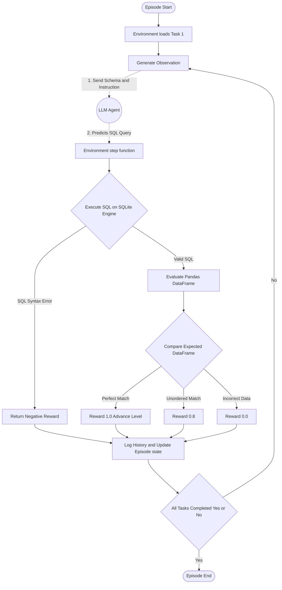

# SQL-RL (OpenEnv)

## Environment Description and Motivation
This environment simulates a real business workflow: a data analyst converting stakeholder requests into executable SQL over an internal company warehouse.

Why this is real-world:
- HR and finance teams routinely need ad-hoc SQL analysis.
- Models must handle schema understanding, joins, aggregation, and constraints.
- Evaluation is done against deterministic graders over actual query results (not string matching).

The environment implements the OpenEnv lifecycle (`reset()`, `step()`, `state()`) and is deployable on Hugging Face Spaces as a containerized service.

## Action Space
`SqlAction`
- `query: str` - a SQL query to execute against the provided SQLite schema.

## Observation Space
`SqlObservation`
- `current_task_instruction: str` - current objective text.
- `schema_info: str` - schema description.
- `task_id: str` - stable task identifier.
- `difficulty: str` - `easy | medium | hard`.
- `execution_result: Optional[str]` - previous query result rows as JSON.
- `execution_error: Optional[str]` - previous execution or safety error.
- `task_score: float` - grader output in `[0.0, 1.0]`.
- `grader_feedback: Optional[str]` - deterministic grader feedback.

## State
`SqlState`
- Tracks episode id, step count, current task index, accumulated reward, per-task scores, and attempts.
- Exposed via `state()` for inspection and reproducibility.

## Tasks and Difficulty Progression
1. **Easy - `employee_payroll_overview`**  
   List employee names and salaries in descending salary order.
2. **Medium - `department_budget_summary`**  
   Compute average salary per department with required output schema.
3. **Hard - `senior_engineering_comp_review`**  
   Multi-table logic to identify engineering employees meeting senior salary thresholds.

All tasks have deterministic graders producing scores from `0.0` to `1.0`.

## Reward Function
Reward is shaped for trajectory-level signal (not binary terminal only):
- `+0.1` valid SQL execution bonus
- `+0.9 * task_score` progress toward correctness
- `-0.02` per step (discourages loops)
- `-0.5` invalid query penalty
- `-1.0` safety penalty for destructive SQL (`DROP/DELETE/TRUNCATE/ALTER/UPDATE/INSERT`)

Task completion threshold is `task_score >= 0.95`.
Episode ends when all tasks are solved or max attempts for a task are exhausted.

## Setup and Usage
1. Install dependencies:
   ```bash
   pip install -r requirements.txt
   ```
2. Set **hackathon-required** variables (OpenAI-compatible client):
   ```bash
   export HF_TOKEN="your-api-key"
   export API_BASE_URL="https://api.openai.com/v1"
   export MODEL_NAME="gpt-4o-mini"
   ```
   `HF_TOKEN` is preferred; `OPENAI_API_KEY` or `API_KEY` are accepted as fallbacks.
3. Run baseline (root `inference.py`):
   ```bash
   python inference.py
   ```

The baseline uses the **OpenAI Python client** (`openai.OpenAI`) with `base_url=API_BASE_URL` and `api_key=HF_TOKEN` (or fallback). For reproducibility on the official OpenAI API, `temperature=0.0` and `seed=OPENAI_SEED` (default `42`) are used when `API_BASE_URL` points at OpenAI.

### Mandatory stdout format (for automated judging)
`inference.py` prints **only** these structured lines to **stdout** (debug goes to **stderr**):

- `[START] task=<name> env=<benchmark> model=<model>`
- `[STEP] step=<n> action=<sql> reward=<0.00> done=<true|false> error=<msg|null>`
- `[END] success=<true|false> steps=<n> score=<0.000> rewards=<r1,r2,...>`

`[END] score` is the mean of best grader scores seen for the three tasks (each in `[0, 1]`). `success` is `true` when the episode ends with `done` and that mean score is ≥ `0.95`.

## Pre-submission validation
Before submitting, run:
```bash
python hf/pre-validation-script.py
```
This checks files, the stdout contract in `inference.py`, syntax, and `openenv validate` (if the CLI is installed).

## Baseline Score Reporting
Structured `[END]` line carries the aggregate score and per-step rewards; use stderr `[DEBUG]` lines only for local troubleshooting.

## Deploy to Hugging Face Spaces (spec checklist)
1. **Create a Space** → **Docker** template, or link this GitHub repo to a Space.
2. **README frontmatter** (top of this file) must stay valid YAML:
   - `sdk: docker`
   - `app_port: 7860` (must match `openenv.yaml` `port` and the container listen port)
   - `tags:` includes `openenv`
3. **Build**: HF runs `docker build` on the repo root; entrypoint is `Dockerfile` `CMD` → Uvicorn on `0.0.0.0:$PORT` (default **7860**).
4. **Health**: platform probes your app; this repo exposes **`GET /health`** and OpenEnv **`POST /reset`** for automated checks.
5. **Push** the same commit you validated locally (`openenv validate`, `python hf/pre-validation-script.py`).

Local smoke test (matches CI-style build):
```bash
docker build -t sql-agent-env .
docker run --rm -p 7860:7860 -e PORT=7860 sql-agent-env
# Then open http://localhost:7860/health and http://localhost:7860/
```

## Docker and Hugging Face Space
- `Dockerfile` runs `uvicorn server.app:app` with **`PORT`** from the environment (default **7860**).
- `.dockerignore` excludes `.env` and build junk so secrets are not copied into the image.
- Space metadata is configured in this `README.md` frontmatter with `sdk: docker`.
- Health endpoint: `/health`
- **Web playground:** open the Space URL (`/`). Click **Connect session** to open a WebSocket to `/ws`, then **Start episode (reset)** and **Run query (step)**. OpenEnv’s HTTP `POST /reset` and `POST /step` each use a fresh environment instance (stateless); the WebSocket session keeps one episode alive for the UI.

Local container run:
```bash
docker build -t sql-agent-env .
docker run -p 7860:7860 sql-agent-env
```

## OpenEnv Metadata
OpenEnv runtime metadata is declared in `openenv.yaml`.

Validation command:
```bash
openenv validate
```



## Internal Engine Design
To read more about exactly how the logic is handled under the hood, access the OOP components inside the root directory:
- `server/environment.py`: The orchestrator handling the OpenEnv lifecycle.
- `database/sqlite_manager.py`: Creates ephemeral SQLite sandboxes per session.
- `core/grader.py`: Deterministic result grader with partial credit and detailed feedback.
